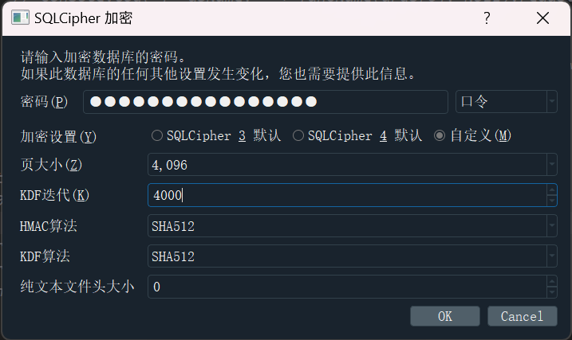

阅读本文前，您应当已经通过其他方法，获取到了数据库的密钥。如果没有，请先阅读对应平台的教程。

（目前）数据库密钥在代码中表示为`pKey`，其值为32位可见字符，例如`abcd1234.,.,ABCD1234567812345678`，以下以`pass`替代。密码在每次打开数据库时都可能改变，您应当在获取密码前、获取密码后均备份一份数据库，并对两份数据库均尝试使用获得的密码解密。

（目前）加密使用SQLCipher，并更改了一些参数。

本教程适用于`nt_msg.db`或`group_msg_fts.db`，也可能可以用于其它部分数据库，以下统一以`nt_msg.db`代替。

## 环境

建议使用 非 Windows 环境。

以下标有`仅 Linux`字样的即代表不可直接使用 Windows 系统的`CMD`或`Powershell`等执行。

若为 Windows，可使用 WSL / Git Bash 等模拟 Linux 环境；若为 Android，可使用 Termux 模拟 Linux 环境。

## 移除无关文件头

由于`nt_msg.db`文件前面有 1024 字节的文件头，导致通常的 SQLite 无法识别。为了使 SQLite 支持读写此类数据库，需要使用以下两种方案中任意一种。

`复制至新文件`方法：优点为可以直接得到一个正常的 SQLite 3 数据库，缺点为需要完整读写整个数据库，导致存储空间占用、存储设备损耗，并且不能直接读写QQ数据目录下的数据库文件。

`使用VFS扩展`方法：解决了`复制至新文件`方法的缺点，但是需要在打开数据库时进行额外操作。

### 复制至新文件

首先，将`nt_msg.db`文件删除前1024字节，这可以通过以下方式完成：

使用二进制编辑器：Android 下的 [MT 管理器](https://d.binmt.cc/)（需要付费）、Windows 下的 [HxD](https://mh-nexus.de/en/hxd/) 等软件均可使用，细节从略。

使用`tail`命令（仅 Linux）：`tail -c +1025 nt_msg.db > nt_msg.clean.db`

使用 Python：`python -c "open('nt_msg.clean.db','wb').write(open('nt_msg.db','rb').read()[1024:])"`

完成后，得到`nt_msg.clean.db`文件。

### 使用VFS扩展

对于详细教程，请参考[此文档](https://github.com/artiga033/ntdb_unwrap/tree/main/sqlite_extension#%E7%94%A8%E6%B3%95)，以下只介绍大概流程。

首先，下载对应平台的动态链接库文件，以下假设文件名为`libsqlite_ext_ntqq_db.so`。不同平台下的文件名可能不同，请在以下流程中使用对应文件名。请勿重命名该文件。

若使用`sqlcipher`命令行，在读取数据库阶段，在运行`.open nt_msg.db`之前，运行`.load libsqlite_ext_ntqq_db.so`。

若使用`DB Browser for SQLite`等图形化界面，首先执行`新建内存数据库`，再执行`工具->加载扩展`，选择`libsqlite_ext_ntqq_db.so`。成功加载后，再打开`nt_msg.db`即可。

## 打开数据库

打开数据库可以通过 [SQLiteStudio](https://sqlitestudio.pl/)、[DB Browser for SQLite](https://sqlitebrowser.org/) 或`sqlcipher`命令行 等工具完成。

## 通用配置选项

见下。注意`cipher_hmac_algorithm`在旧版本中可能为`HMAC_SHA256`，以下部分截图也使用了此值，请自行尝试更改。

```shell
PRAGMA key = 'pass';    -- pass 替换为之前得到的密码（32字节字符串）
PRAGMA cipher_page_size = 4096;
PRAGMA kdf_iter = 4000; -- 非默认值 256000
PRAGMA cipher_hmac_algorithm = HMAC_SHA1; -- 非默认值（见上文）
PRAGMA cipher_default_kdf_algorithm = PBKDF2_HMAC_SHA512;
PRAGMA cipher = 'aes-256-cbc';
```

### DB Browser for SQLite

选择 `nt_msg.clean.db`，按需修改`KDF iterations`与`HMAC algorithm`（见上文[通用配置选项](#通用配置选项)修改）：





### SQLiteStudio

数据库类型选 SQLCipher，密码（密钥）为空，加密算法配置（可选）输入上文[通用配置选项](#通用配置选项)中内容。

### sqlcipher CLI

> 参考资料：[找到了Linux QQ NT聊天记录数据库密钥](https://gist.github.com/bczhc/c0f29920d4e9d0cc6d2c49f7f2fb3a78)

对于Linux，从包管理器安装`sqlcipher`包；对于Windows，从[QQBackup/sqlcipher-github-actions](https://github.com/QQBackup/sqlcipher-github-actions/releases/tag/latest)下载SQLCipher可执行文件。

以下命令适用于Linux环境下的Bash等shell，Windows下可使用Git Bash等代替。

`sqlcipher nt_msg.clean.db "pragma key = 'pass'; pragma kdf_iter = 4000; pragma cipher_hmac_algorithm = HMAC_SHA1;" .d | tail +2 | sqlite3 nt_msg.decrypt.db`

## 读取数据库内容

请参考 [基础教程 - NTQQ 读取数据库](基础教程%20-%20NTQQ%20读取数据库.md)。
