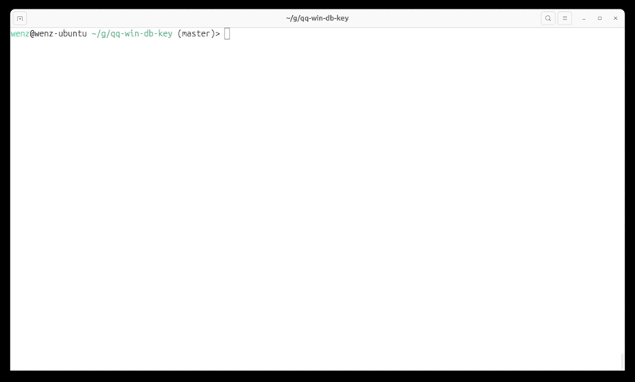

# 需要的软件软件以及可能的下载方式  

## 1. **GDB**:
`GDB` 是 GNU 调试器，可以通过以下方式下载：
- **Ubuntu/Debian**:  
    ```bash
    sudo apt install gdb
    ```

- **Fedora/RHEL**:  
    ```bash
    sudo dnf install gdb
    ```
    
- **验证GDB是否支持Python**  
    在gdb下运行如下命令
    ```
    (gdb) python print("Hello from Python in GDB")
    ```
    如果没有错误，并且输出了`Hello from Python in GDB`，那么 Python 支持已启用。

## 2. **Readelf 和 Objdump**:
`readelf` 和`objdump` 是 `binutils` 包的一部分，可以通过`binutils`安装
- **Ubuntu/Debian**:
    ```bash
    sudo apt install binutils
    ```
- **Fedora/RHEL**:
    ```bash
    sudo dnf install binutils
    ```

# 使用方式

**由于python脚本帮我们简化了太多操作，使用非常简单**

下载并找到`linuxqq_get_key.py`
打开终端并输入
```bash
gdb -x <PATH_TO_LINUXQQ_GET_KEY_PY> qq
```
这里的`<PATH_TO_LINUXQQ_GET_KEY_PY>`需要替换成具体的存放`linuxqq_get_key.py`这个脚本文件的位置。  
初始化过程因为需要反编译`wrapper.node`, 所以第一次运行会有点慢。  
等QQ的窗口弹出后正常的登录即可。若成功QQ会自动关闭， 这时在终端中可查看密钥。如果QQ正常的登录并弹出了消息界面，这多半是脚本出问题了，如果你乐意可以试着解决他。  
脚本会自动的将反编译后得到的一些必要信息保存在本地（当前路径下），所以如果想要多次使用，或者不希望他随地乱丢垃圾的话， 可以专门把它放在一个目录下。  

大致的效果就像这样
